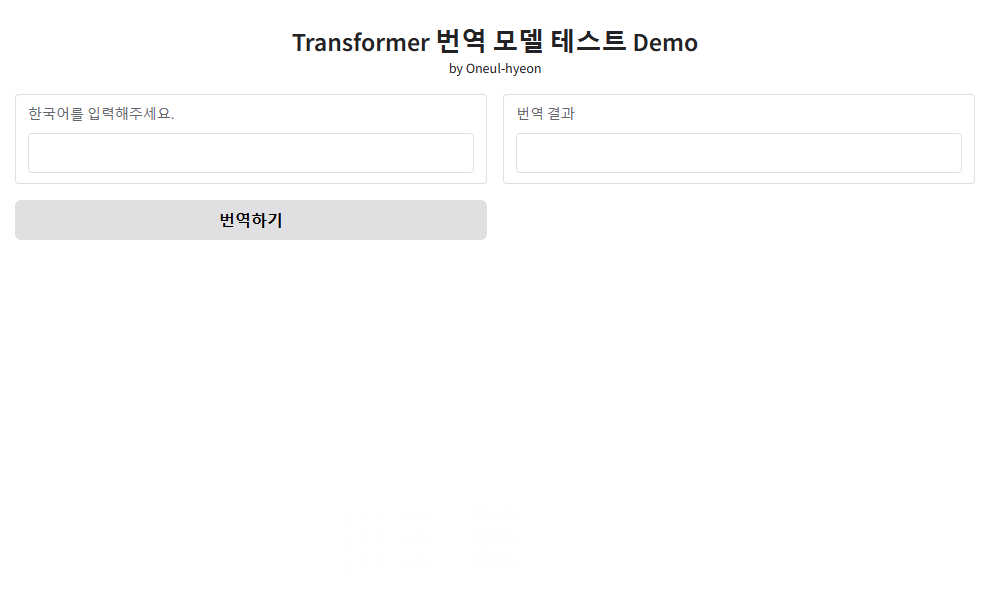

# Transformer-based Korean-English translator

Transformer 모델 기반의 한-영 번역기

## Before Starting

해당 프로젝트는 [Transformer 논문](https://arxiv.org/pdf/1706.03762) 모델 구현을 위한 프로젝트입니다. 

따라서 논문에 소개된 내용 기반으로 번역 모델을 제작하였으며, 추가적인 성능 개선을 위한 작업은 진행하지 않았습니다. 

프로젝트의 큰 프로세스는 `토크나이저 제작`, `데이터셋 제작`, `모델 학습`, `Demo`으로 구성됩니다.

## Structure

```
transformer
├── main.py                          #  각 프로세스 실행을 위한 main 파일
├── data                             #  프로젝트에 사용되는 데이터 폴더
|   ├── df                           #  데이터셋 제작 시 저장되는 데이터프레임 폴더
|   ├── raw                          #  프로젝트에서 사용되는 raw 데이터 폴더
├── img                              #  training 과정의 loss graph 저장 폴더
├── log                              #  training 과정 관련 log 폴더
├── model                            #  trainging 후 모델 저장 폴더
├── tokenizer                        #  제작된 tokenizer 저장 폴더
├── src                              #  Code Source
|   ├── attention.py                 #  Attention 구현 파일
|   ├── builder.py                   #  dataloader 제작 파일
|   ├── decoder.py                   #  Transformer Decoder 구현 파일
|   ├── demo.py                      #  Gradio Demo 파일
|   ├── encoder.py                   #  Transformer Encoder 구현 파일
|   ├── feedforward.py               #  FeedForward Network 구현 파일
|   ├── make_dataset.py              #  RAW 기반 데이터프레임 제작 파일
|   ├── make_tokenizer.py            #  Tokenizer 제작 파일
|   ├── positional_encoding.py       #  Positional Encoding 제작 파일
|   ├── scheduler.py                 #  Training Scheduler 구현 파일
|   ├── tokenizer.py                 #  제작된 Tokenizer 기반 Tokenizing 파일
|   ├── train.py                     #  Model Training
|   ├── transformer.py               #  Transformer 구현 파일
|   ├── translator.py                #  Inference 구현 파일
```

## Datasets

프로젝트에서 사용된 Data는 `AI-HUB`에서 제공하는 [한국어-영어 번역(병렬) 말뭉치](https://www.aihub.or.kr/aihubdata/data/view.do?currMenu=&topMenu=&aihubDataSe=data&dataSetSn=126)를 사용하였습니다.

```
RAW Data
├── 1_구어체(1).xlsx
├── 1_구어체(2).xlsx
├── 2_대화체.xlsx
├── 3_문어체_뉴스(1)_200226.xlsx
├── 3_문어체_뉴스(2).xlsx
├── 3_문어체_뉴스(3).xlsx
├── 3_문어체_뉴스(4).xlsx
├── 4_문어체_한국문화.xlsx
├── 5_문어체_조례.xlsx
├── 6_문어체_지자체웹사이트.xlsx
```

## Environments

프로젝트에 진행된 환경을 소개합니다.

```
GPU : GeForce RTX 3090
CUDA : 11.8
Python Version : 3.10.15
```

## Process

### 00. Make Tokenizer

한국어 & 영어 Tokenizer는 [tokenizers](https://github.com/huggingface/tokenizers) 패키지의 `Character BPE tokenizer`로 학습을 통해 제작되었습니다.

각 언어 별 사전 크기는 `32000`이며 `<pad>`, `<unk>`, `<s>`, `</s>`, `<mask>`가 special token으로 추가되었습니다.

아래의 Code를 통해 한국어 & 영어 Tokenizer를 제작할 수 있습니다.
(`data/raw` 내에 `raw data`가 위치해야 합니다.)

```
python main.py --mode make_tokenizer
```

Code 수행 과정으로써 `raw data`에 개반하여 토크나이저를 제작하고 제작된 토크나이저 파일은 `tokenizer` 폴더 내 `kr_tokenizer.json`, `en_tokenizer.json` 에 저장됩니다.

제작된 토크나이저는 `src/tokenizer.py`에서 활용됩니다.

### 01. Make Dataset

`Transformer` 모델 학습을 위한 데이터프레임 형식의 파일을 제작합니다.

아래 Code를 통해 해당 Process를 수행할 수 있습니다.

```
python main.py --mode make_dataset
```

Process 수행의 결과로 `data/df` 내 `df.csv` 파일이 생성됩니다.

### 02. Training

모델 학습에 사용되는 `hyperparameter` 는 아래와 같습니다.

```
src_vocab_size = 32000
tgt_vocab_size = 32000
d_model = 512
n = 6
head = 8
dropout = 0.1
d_ff = 2048
warmup_steps=4000
```

또한 `Epochs` 값은 `5`로 설정하였으며, `batch size = 64`로 설정 시 학습 관련 메모리 및 `Epoch` 당 소요 시간을 알려드립니다.

```
batch size = 64로 설정 시,

    - VRAM 사용량 : 약 16 GB
    - 1 Epoch 당 소요 시간 : 약 3시간
```

아래 Code를 통해, 모델 학습을 수행합니다.

```
python main.py --mode train
```

최적의 `Loss` 값을 갖는 Model의 `state dictionary`가 `model` 폴더 내 `model.pt`의 파일로 저장됩니다.

### 03. Demo

번역 성능(모델의 추론 결과)를 간단한 `gradio` 데모를 통해 확인할 수 있습니다.

```
Python main.py --mode demo
```



## Conclusion

해당 프로젝트를 진행하며 사용한 데이터는 약 150만 개의 한 문장으로 구성된 한국어-영어 시퀀스입니다. 해당 데이터에 더해 더 다양한 표현의 데이터를 추가해 학습을 진행한다면 사용된 데이터와 다른 형식의 문체 및 표현 또한 더 자연스럽고 좋은 성능의 번역을 수행할 것이라 판단됩니다. 물론 Model 구현, Hyperparameter 및 scheduler의 측면에서도 더 좋은 성능을 갖도록 할 수 있도록 하는 여러 시도가 필요하지만, `Transformer` 아키텍처를 기반으로 제작된 모델의 뛰어난 성능과 더불어 모델 학습에 사용되는 데이터 또한 중요하다고 느꼈던 프로젝트입니다.